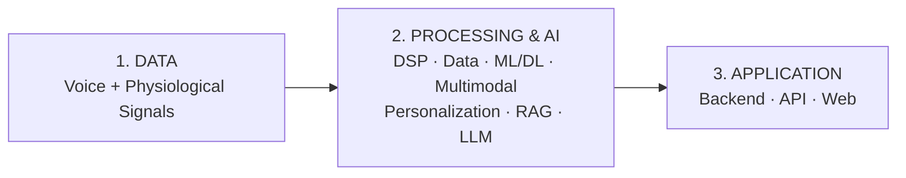
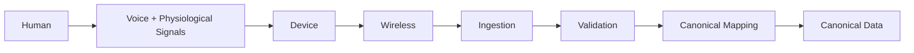
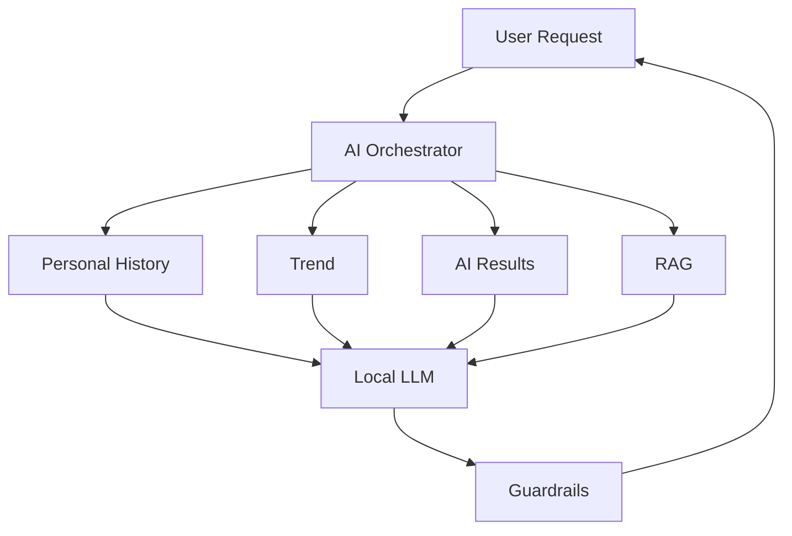
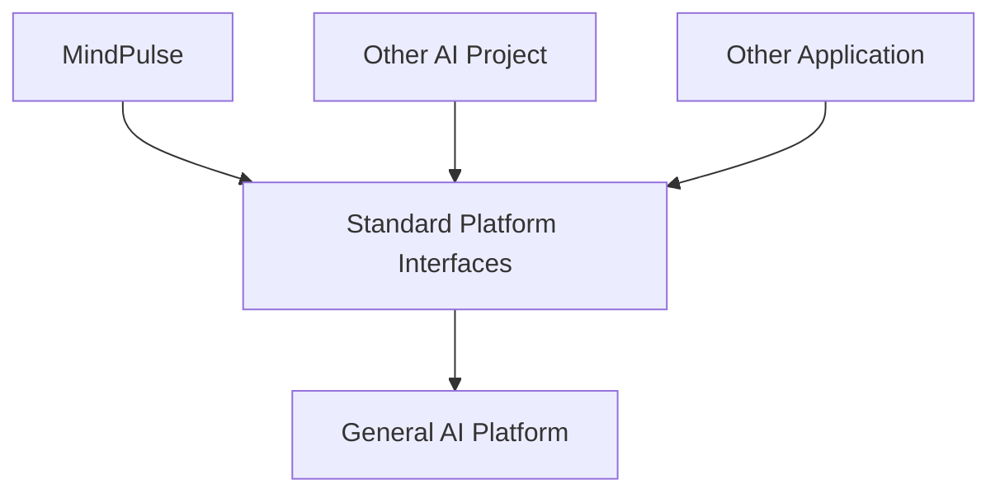
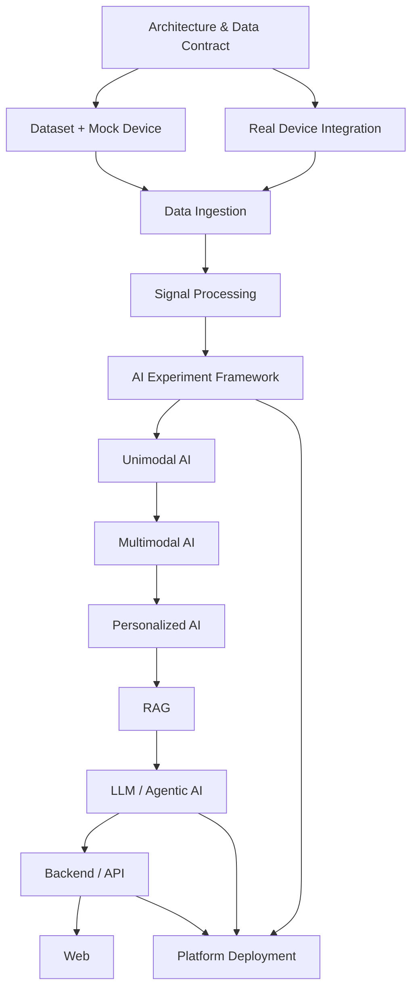

# MindPulse

### Personalized Multimodal Mental Wellness AI

**MindPulse** là dự án nghiên cứu và phát triển hệ thống AI đa phương thức cho **personalized mental wellness**, kết hợp tín hiệu giọng nói, tín hiệu sinh lý, dữ liệu theo thời gian và AI để mô hình hóa trạng thái nền của từng cá nhân và phát hiện những thay đổi đáng chú ý so với chính baseline của người đó.

Dự án tập trung chủ yếu vào các bài toán thuộc **Computer Science, Data Engineering và Artificial Intelligence**, bao gồm:

- Signal Processing;
- Time-Series Processing;
- Data Engineering;
- Machine Learning / Deep Learning;
- Representation Learning;
- Multimodal Learning;
- Personalized AI;
- Anomaly / Deviation Detection;
- Retrieval-Augmented Generation (RAG);
- Local Large Language Models (LLM);
- AI Orchestration / Agentic AI;
- Backend / API;
- Web Application.

MindPulse là một **research & engineering project**, không phải hệ thống chẩn đoán y khoa.

---

# 1. Lý do chọn đề tài

Mental wellness là một bài toán khó đối với AI vì trạng thái con người không thể được mô tả đầy đủ chỉ bằng một giá trị đơn lẻ.

Hai người có thể có các đặc điểm sinh lý hoặc hành vi rất khác nhau ngay cả khi đều đang ở trạng thái bình thường.

Vì vậy, một mô hình chỉ dựa trên population-level thresholds có thể bỏ qua sự khác biệt cá nhân.

MindPulse tiếp cận bài toán theo hướng:

```text
Current Multimodal State
          +
Personal Historical Data
          ↓
Personal Baseline
          ↓
Personalized AI
          ↓
Deviation / Trend
```

Thay vì chỉ đặt câu hỏi:

> Người dùng thuộc class nào?

MindPulse tập trung nhiều hơn vào:

> **Trạng thái hiện tại của người dùng khác trạng thái nền của chính họ như thế nào?**

Đây là lý do **personalization** và **longitudinal analysis** được xem là hai hướng nghiên cứu quan trọng của dự án.

---

# 2. Vì sao sử dụng Multimodal Data?

Một modality riêng lẻ thường chỉ phản ánh một phần trạng thái của người dùng.

MindPulse vì vậy nghiên cứu sự kết hợp giữa:

```text
Behavioral Information
        +
Physiological Information
        +
Temporal / Personal Context
```

Trong phiên bản hiện tại, hai nguồn tín hiệu chính được ưu tiên là:

```text
Voice
  +
PPG / Heart-related Physiological Signals
```

Hai modality này được chọn vì chúng cung cấp hai góc nhìn khác nhau và có khả năng bổ sung cho nhau.

---

# 3. Vì sao chọn Voice?

Giọng nói không chỉ chứa nội dung ngôn ngữ.

Audio còn chứa nhiều đặc trưng phi ngôn ngữ như:

- pitch;
- energy;
- speaking rate;
- pause pattern;
- rhythm;
- spectral characteristics;
- voice activity;
- temporal variation.

Do đó Voice có thể được nghiên cứu như một **behavioral/acoustic modality**.

Pipeline tổng quát:

```text
Raw Audio
    ↓
Validation
    ↓
Preprocessing
    ↓
Voice Activity Detection
    ↓
Segmentation
    ↓
Time-Frequency / Waveform Representation
    ↓
Voice Encoder
    ↓
Voice Representation
```

MindPulse không khóa pipeline vào một representation duy nhất.

Tùy model, input có thể là:

```text
Raw Waveform
Log-Mel Spectrogram
Spectrogram
Handcrafted Acoustic Features
Learned Audio Representation
```

Điều này cho phép benchmark cả classical signal processing và modern representation learning.

---

# 4. Vì sao chọn PPG và Heart-related Signals?

Voice phản ánh nhiều thông tin behavioral/acoustic, nhưng không trực tiếp cung cấp cùng loại thông tin physiological.

Vì vậy MindPulse bổ sung một modality sinh lý.

PPG (**Photoplethysmography**) đo sự thay đổi thể tích máu ngoại vi theo thời gian thông qua tín hiệu quang học.

Từ PPG có thể nghiên cứu và suy ra các thông tin như:

```text
Pulse Waveform
        ↓
Pulse Peaks
        ↓
Inter-Beat Intervals
        ↓
Heart / Pulse Rate
        ↓
Pulse Rate Variability
        ↓
Temporal Physiological Features
```

PPG được lựa chọn ban đầu vì:

- có dạng time-series rõ ràng;
- có thể thu liên tục;
- phù hợp cho signal processing;
- có thể cung cấp heart-related temporal information;
- tương đối thuận lợi cho wearable/non-invasive sensing;
- bổ sung một physiological modality cho Voice.

MindPulse không mặc định xem mọi feature từ PPG tương đương hoàn toàn với ECG-derived HRV.

Khi phù hợp, variability được suy ra từ pulse intervals nên được diễn giải là **Pulse Rate Variability (PRV)**.

---

# 5. Tại sao kết hợp Voice + Physiological Signals?

Hai modality mô tả hai loại thông tin khác nhau:

| Modality | Loại thông tin chính |
|---|---|
| Voice | Behavioral / Acoustic |
| PPG / Heart-related signals | Physiological / Temporal |

Ý tưởng của multimodal learning là:

```text
Voice
  │
  ▼
Voice Representation
          │
          ├──────────┐
          │          │
PPG       │          ▼
  │       │    Multimodal Fusion
  ▼       │          │
Physiological        ▼
Representation  Joint Representation
                     │
                     ▼
               Personalized AI
```

Nếu một modality bị nhiễu hoặc không đủ thông tin, modality còn lại có thể cung cấp complementary information.

Đây là một trong những research questions chính của dự án:

> **Voice + physiological signals có cung cấp representation ổn định và hữu ích hơn từng modality riêng lẻ hay không?**

Câu hỏi này phải được trả lời bằng benchmark và ablation study thay vì giả định trước.

---

# 6. Kiến trúc tổng thể

MindPulse được chia thành ba phần lớn:



Ở mức hệ thống:

```text
Physical Signals
       ↓
Device
       ↓
Wireless Transmission
       ↓
Data Ingestion
       ↓
Canonical Data
       ↓
Signal Processing
       ↓
AI Representation
       ↓
Multimodal Learning
       ↓
Personalized AI
       ↓
Structured AI Result
       ↓
RAG / LLM / AI Orchestration
       ↓
Backend / API
       ↓
Web Application
```

---

# 7. Khối 1 — Data

Khối Data chịu trách nhiệm biến tín hiệu thực thành dữ liệu có cấu trúc để phần software có thể sử dụng.



MindPulse không yêu cầu AI code phụ thuộc trực tiếp vào sensor hoặc packet format cụ thể.

Thay vào đó:

```text
Device-specific Data
        ↓
Device Data Contract
        ↓
Canonical Data Model
        ↓
DSP / AI
```

---

# 8. Device Data Contract

Phần Device/Hardware/Firmware được phát triển như một engineering domain riêng.

Hai phía thống nhất thông qua:

```text
contracts/device/
```

Contract xác định những thành phần như:

```text
schema_version
device_id
session_id
sequence_id
timestamp
modality
sample_rate
unit
payload
signal_quality
device_status
```

Nguyên tắc:

> **Hardware có thể thay đổi, nhưng interface dữ liệu với software phải ổn định và được version hóa.**

Nhờ đó:

```text
Sensor A ─┐
Sensor B ─┼→ Canonical Data → DSP → AI
Sensor C ─┘
```

AI pipeline không cần được thiết kế lại mỗi khi phần cứng thay đổi.

---

# 9. Data Engineering

Sau khi nhận dữ liệu:

```text
Wireless Stream
      ↓
Receiver
      ↓
Parser
      ↓
Schema Validation
      ↓
Timestamp / Sequence Validation
      ↓
Canonical Mapping
      ↓
Session Reconstruction
      ↓
Quality Control
      ↓
Structured Dataset
```

Data layer xử lý các vấn đề như:

- missing packets;
- duplicated packets;
- timestamp errors;
- packet ordering;
- session reconstruction;
- missing modality;
- data quality;
- dataset versioning;
- metadata consistency.

Đây là boundary giữa **data acquisition** và **AI processing**.

---

# 10. Dataset Strategy

AI development không phụ thuộc hoàn toàn vào việc hardware đã hoàn thiện hay chưa.

MindPulse sử dụng ba nhóm dữ liệu:

```text
Public Datasets
       +
Synthetic / Mock Data
       +
Real Device Data
        ↓
Canonical Data Representation
```

### Public datasets

Dùng cho:

- DSP development;
- model prototyping;
- representation learning;
- benchmark;
- multimodal experiments.

### Mock data / Mock device

Dùng để test:

- ingestion;
- API;
- packet handling;
- missing packets;
- jitter;
- reconnect;
- synchronization;
- missing modality.

### Real device data

Được sử dụng khi acquisition system đủ ổn định và đáp ứng Data Contract.

---

# 11. Khối 2 — Signal Processing

Raw signals không được đưa trực tiếp vào AI mà không qua validation và quality control.

## Voice

```text
Raw Audio
    ↓
Validation
    ↓
Resampling
    ↓
Normalization
    ↓
Voice Activity Detection
    ↓
Segmentation
    ↓
Feature / Representation Extraction
    ↓
Quality Control
```

Tùy model, representation có thể là waveform, spectrogram, Log-Mel hoặc learned representation.

## Physiological Signal

```text
Raw PPG
    ↓
Validation
    ↓
Baseline / Noise Processing
    ↓
Filtering
    ↓
Artifact Detection
    ↓
Signal Quality
    ↓
Peak Detection
    ↓
Inter-Beat Information
    ↓
Physiological Features / Sequence
```

Signal-quality information được giữ lại để AI biết mức độ đáng tin cậy của input.

---

# 12. AI Research Pipeline

MindPulse không chọn final model ngay từ đầu.

Quy trình:


Model selection phải dựa trên experiment.

Các tiêu chí không chỉ gồm predictive performance mà còn:

- robustness;
- generalization;
- representation quality;
- multimodal gain;
- latency;
- memory;
- compute requirement;
- stability;
- deployment feasibility.

---

# 13. Voice AI Candidates

Một số model family có thể được benchmark:

| Hướng | Candidate |
|---|---|
| Baseline | CNN / CRNN |
| Self-Supervised Speech | wav2vec 2.0 |
| Self-Supervised Speech | HuBERT |
| Self-Supervised Speech | WavLM |
| Audio Transformer | AST |
| Audio Representation | BEATs |

Không model nào trong danh sách trên được xem là final model trước khi có kết quả thực nghiệm.

---

# 14. Physiological AI Candidates

Đối với physiological/time-series data:

| Hướng | Candidate |
|---|---|
| CNN | 1D CNN |
| Residual Network | ResNet1D |
| Temporal Modeling | TCN |
| Recurrent | GRU / LSTM |
| Attention | Transformer Encoder |
| Time-Series Foundation | PatchTST / TimesNet |
| Representation Learning | Self-Supervised Time-Series Models |

Các model được benchmark trên cùng data split và evaluation protocol khi có thể.

---

# 15. Multimodal Learning

Sau khi mỗi modality được encoder:

```text
Voice
 ↓
Voice Encoder
 ↓
Voice Representation
          \
           \
            → Alignment → Fusion → Multimodal Representation
           /
          /
PPG / Physiological
 ↓
Physiological Encoder
 ↓
Physiological Representation
```

Các hướng fusion cần nghiên cứu:

- concatenation baseline;
- MLP fusion;
- gated fusion;
- quality-aware fusion;
- attention;
- cross-attention;
- multimodal Transformer.

Ngoài accuracy/performance, cần kiểm tra:

```text
Voice only
vs
Physiological only
vs
Voice + Physiological
```

để xác định multimodal learning thực sự tạo ra giá trị hay không.

---

# 16. Personalized AI

Đây là một trong những phần nghiên cứu trung tâm của MindPulse.

```text
Historical Data
       ↓
Personal Baseline
       │
       ├─────────────┐
       │             │
       │       Current State
       │             │
       └──────┬──────┘
              ↓
       Personalized Model
              ↓
     Deviation / Anomaly
              ↓
      Longitudinal Trend
```

Các hướng có thể benchmark:

- statistical baseline;
- distance-based methods;
- Z-score;
- Mahalanobis distance;
- Isolation Forest;
- One-Class SVM;
- Autoencoder;
- Variational Autoencoder;
- Deep SVDD;
- các personalized anomaly models khác.

Các thuật toán này là **research candidates**, không phải architecture cố định.

---

# 17. Baseline và Concept Drift

Trạng thái của một người có thể thay đổi theo thời gian.

Vì vậy baseline không nên được xem là một giá trị cố định vĩnh viễn.

```text
New Observation
      ↓
Signal Quality
      ↓
Deviation Analysis
      ↓
Temporal Consistency
      ↓
Drift Analysis
      ↓
Controlled Baseline Adaptation
```

Một observation bất thường không được tự động đưa vào baseline.

Baseline adaptation cần xem xét:

- data quality;
- persistent change;
- temporary deviation;
- distribution shift;
- sensor change;
- lifestyle/context changes;
- baseline contamination.

---

# 18. Structured AI Result

Output của ML/DL được chuẩn hóa trước khi chuyển cho tầng intelligence.

```text
Voice AI ───────────┐
                    │
Physiological AI ───┤
                    │
Multimodal AI ──────┼→ Structured AI Result
                    │
Personalized AI ────┤
                    │
Signal Quality ─────┘
```

Structured result có thể chứa:

```text
signal quality
physiological information
modality availability
model confidence
deviation score
personal threshold
trend
model/version metadata
```

LLM không trực tiếp quyết định các measurement hoặc anomaly score từ raw signal.

---

# 19. RAG

RAG được sử dụng như knowledge layer.

```text
Trusted Documents
       ↓
Cleaning
       ↓
Chunking
       ↓
Embedding
       ↓
Vector Index
       ↓
Retrieval
       ↓
Reranking
       ↓
Relevant Context
       ↓
LLM
```

RAG giúp LLM dựa vào nguồn kiến thức có kiểm soát thay vì chỉ dựa vào internal model knowledge.

Knowledge base cần có:

- source;
- provenance;
- version;
- metadata;
- retrieval traceability.

---

# 20. Local LLM

MindPulse không khóa vào một LLM duy nhất.

Các model family có thể benchmark gồm:

```text
Llama
Qwen
Gemma
Mistral
Other suitable local/open-weight models
```

Các tiêu chí đánh giá:

- Vietnamese capability;
- English capability;
- reasoning;
- structured output;
- RAG faithfulness;
- hallucination;
- tool calling;
- latency;
- memory;
- VRAM;
- quantization;
- context length.

---

# 21. AI Orchestration / Agentic Layer

Tầng orchestration kết nối các AI capability.



Agent có thể lựa chọn tool hoặc data source phù hợp nhưng không được tự ý sửa model state hoặc personal baseline ngoài policy của hệ thống.

---

# 22. Khối 3 — Backend, API và Web

Backend là application layer kết nối:

```text
Data
 +
AI
 +
Personalization
 +
RAG
 +
LLM
 +
Database
      ↓
Backend
      ↓
API
      ↓
Web Application
```

Các service dự kiến:

- Session Service;
- Measurement Service;
- Signal Quality Service;
- AI Inference Service;
- Baseline Service;
- Trend Service;
- RAG Service;
- Assistant Service.

API được version hóa, ví dụ:

```text
/api/v1/
```

REST và WebSocket có thể được sử dụng tùy loại dữ liệu và yêu cầu realtime.

---

# 23. Web Application

Web App là interface chính với người dùng.

Các module có thể gồm:

```text
Dashboard
Current Session
Signal Quality
Physiological Information
Historical Data
Personal Baseline
Deviation / Trend
AI Result
RAG Explanation
Sources
AI Assistant
Device Status
```

Web App không thực hiện AI inference trực tiếp.

```text
Web
 ↓
API
 ↓
Backend
 ↓
AI / Data / RAG / LLM
```

---

# 24. General-AI-Platform

Infrastructure của MindPulse được tách khỏi repository này.

Một repository độc lập được sử dụng để xây dựng hạ tầng dùng chung:

```text
General-AI-Platform
```

Platform không được thiết kế riêng cho MindPulse.

Nó có thể phục vụ:

```text
MindPulse
Project A
Project B
Project C
...
```

Kiến trúc conceptual:



---

# 25. MindPulse sử dụng Platform

MindPulse đóng vai trò **consumer** của General-AI-Platform.

Platform có thể cung cấp:

```text
CPU Compute
GPU Compute
Persistent Storage
Object Storage
Relational Database Infrastructure
Vector Database Infrastructure
Container Runtime
AI Training Runtime
AI Inference Runtime
Model Serving
LLM Serving
Embedding Serving
Observability
Logging
Security Infrastructure
CI/CD Infrastructure
Backup Infrastructure
```

MindPulse vẫn sở hữu toàn bộ:

```text
domain logic
data schema
DSP
ML/DL code
model experiments
personalization logic
RAG logic
prompt/orchestration logic
application database schema
API logic
web application
```

---

# 26. AI Training trên Platform

Ví dụ workflow:

```text
MindPulse Repository
       ↓
Training Code
       ↓
Container
       ↓
General-AI-Platform
       ↓
GPU Runtime
       ↓
Training
       ↓
Model Artifact / Checkpoint
```

Nhờ đó project engineer tập trung vào:

- dataset;
- model;
- training;
- evaluation;

trong khi Platform Engineer quản lý:

- GPU infrastructure;
- runtime;
- storage;
- resource isolation;
- monitoring.

---

# 27. AI Inference và Model Serving

Production-like inference có thể sử dụng:

```text
MindPulse Backend
       ↓
Inference Request
       ↓
Model Serving Interface
       ↓
General-AI-Platform
       ↓
CPU / GPU Runtime
       ↓
Model
       ↓
Inference Result
```

Application không cần quản lý trực tiếp GPU driver hoặc compute host.

---

# 28. RAG / LLM trên Platform

LLM có thể được host trên General-AI-Platform:

```text
MindPulse
   ↓
RAG
   ↓
Retrieved Context
   ↓
LLM Serving API
   ↓
General-AI-Platform
   ↓
Local LLM
   ↓
Response
```

Tương tự, embedding model có thể được expose dưới dạng generic embedding service.

MindPulse sở hữu RAG logic.

Platform sở hữu generic runtime/serving infrastructure.

---

# 29. Boundary giữa hai Repository

Nguyên tắc:

```text
MindPulse
=
Project / Domain / AI Logic

General-AI-Platform
=
Reusable Infrastructure
```

| Thành phần | MindPulse | General-AI-Platform |
|---|---:|---:|
| Voice DSP | Yes | No |
| PPG processing | Yes | No |
| Dataset logic | Yes | No |
| Multimodal AI | Yes | No |
| Personal baseline | Yes | No |
| RAG logic | Yes | No |
| Agent logic | Yes | No |
| Web/API | Yes | No |
| GPU infrastructure | No | Yes |
| Generic storage | No | Yes |
| Generic database infrastructure | No | Yes |
| AI runtime | No | Yes |
| Generic model serving | No | Yes |
| LLM runtime | No | Yes |
| Infrastructure monitoring | No | Yes |
| Backup infrastructure | No | Yes |

---

# 30. Local / Private AI Architecture

MindPulse hướng đến khả năng xử lý dữ liệu trên hạ tầng local/private.

```text
User
 ↓
Sensing Device
 ↓
Wireless
 ↓
Local Network
 ↓
MindPulse Data Pipeline
 ↓
DSP / AI
 ↓
General-AI-Platform
 ├── Compute
 ├── GPU
 ├── Storage
 ├── AI Runtime
 └── Model / LLM Serving
 ↓
MindPulse Backend
 ↓
API
 ↓
Web Application
```

Điều này giúp hệ thống có khả năng kiểm soát tốt hơn đối với:

- data location;
- model deployment;
- inference;
- compute;
- storage;
- privacy;
- system architecture.

---

# 31. Repository Structure

```text
MindPulse/
│
├── contracts/
│   └── device/
│
├── project/
│   ├── ingestion/
│   ├── data/
│   │
│   ├── signal/
│   │   ├── audio/
│   │   └── physiological/
│   │
│   ├── ai/
│   │   ├── registry/
│   │   ├── voice/
│   │   ├── physiological/
│   │   ├── fusion/
│   │   ├── personalization/
│   │   └── experiments/
│   │
│   ├── intelligence/
│   │   ├── rag/
│   │   ├── llm/
│   │   └── orchestration/
│   │
│   ├── backend/
│   └── common/
│
├── web/
│
├── device/
│   ├── specifications/
│   ├── hardware/
│   ├── firmware/
│   ├── validation/
│   └── docs/
│
├── tools/
│   ├── mock_device/
│   ├── replay/
│   ├── dataset_download/
│   └── benchmark/
│
├── configs/
├── tests/
├── docs/
└── artifacts/
```

---

# 32. Development Roadmap



Chi tiết task, owner, branch, folder, file và acceptance criteria được quản lý tại:

```text
TASK_CHECKLIST.md
```

---

# 33. Research Questions

Một số câu hỏi chính mà MindPulse cần trả lời bằng thực nghiệm:

1. Voice representation nào phù hợp nhất cho bài toán?
2. Physiological representation nào ổn định nhất?
3. Voice + PPG có tốt hơn từng modality riêng lẻ không?
4. Fusion architecture nào phù hợp nhất?
5. Signal quality ảnh hưởng tới AI như thế nào?
6. Làm thế nào khi một modality bị thiếu?
7. Personal baseline cần bao nhiêu dữ liệu?
8. Personalized model có cải thiện so với population model không?
9. Baseline nên thích nghi theo thời gian như thế nào?
10. Làm thế nào phát hiện concept drift?
11. RAG cải thiện độ grounded của LLM ở mức nào?
12. Local LLM nào đạt cân bằng tốt giữa chất lượng và tài nguyên?
13. Workload nào nên chạy CPU, GPU hoặc thiết bị biên?
14. Kiến trúc local/private có đáp ứng latency cần thiết không?

---

# 34. Evaluation Strategy

MindPulse không đánh giá hệ thống chỉ bằng một metric.

```text
Data Quality
    ↓
Signal Processing Quality
    ↓
Representation Quality
    ↓
Unimodal Performance
    ↓
Multimodal Gain
    ↓
Personalization Gain
    ↓
Robustness
    ↓
RAG / LLM Quality
    ↓
Latency / Resource Usage
    ↓
End-to-End System Performance
```

Các experiment quan trọng:

- Voice-only vs physiological-only vs multimodal;
- population vs personalized;
- classical baseline vs deep learning;
- fusion ablation;
- missing-modality test;
- noisy-signal test;
- cross-user evaluation;
- temporal evaluation;
- latency benchmark;
- CPU/GPU benchmark;
- RAG retrieval evaluation;
- LLM faithfulness evaluation.

---

# 35. Nguyên tắc kỹ thuật

### Data quality trước AI

Dữ liệu chất lượng thấp phải được phát hiện trước khi ảnh hưởng đến model.

### Contract-first

Hardware và software giao tiếp thông qua versioned contract.

### Hardware-independent software

Thay sensor không nên yêu cầu viết lại toàn bộ AI pipeline.

### Model-agnostic research

Không chọn model cuối cùng trước khi benchmark.

### Multimodal phải được chứng minh

Không mặc định nhiều modality luôn tốt hơn một modality.

### Personalization phải được đánh giá

Personal model phải được so sánh với population baseline.

### Reproducibility

Dataset, preprocessing, model, config và experiment phải được version hóa.

### LLM không thay thế signal-processing/ML pipeline

LLM nhận structured information; không tự suy diễn raw physiological signal.

### Platform-independent project logic

MindPulse không phụ thuộc vào implementation nội bộ của infrastructure.

### Local-first khi phù hợp

AI, data và model serving được ưu tiên triển khai trên local/private infrastructure khi đáp ứng được yêu cầu kỹ thuật.

---

# 36. Phạm vi nghiên cứu và giới hạn

MindPulse tập trung vào:

> **Personalized multimodal mental-wellness computing**

Dự án không tuyên bố:

- chẩn đoán bệnh tâm thần;
- thay thế bác sĩ;
- cung cấp medical diagnosis;
- suy luận clinical condition chỉ từ anomaly score.

Các kết quả như:

```text
Deviation
Trend
Anomaly
Signal Quality
Model Confidence
```

là output kỹ thuật của hệ thống và phải được diễn giải đúng phạm vi.

---

# 37. Tóm tắt kiến trúc

```text
                         USER
                           │
                           ▼
                    PHYSICAL SIGNALS
                           │
                    ┌──────┴──────┐
                    ▼             ▼
                  VOICE          PPG
                    │             │
                    └──────┬──────┘
                           ▼
                         DEVICE
                           │
                       Wireless
                           │
                           ▼
                  DEVICE DATA CONTRACT
                           │
                           ▼
                    DATA INGESTION
                           │
                           ▼
                    CANONICAL DATA
                           │
                           ▼
                  SIGNAL PROCESSING
                           │
                    ┌──────┴──────┐
                    ▼             ▼
                VOICE AI     PHYSIOLOGICAL AI
                    │             │
                    └──────┬──────┘
                           ▼
                   MULTIMODAL AI
                           │
                           ▼
                  PERSONALIZED AI
                           │
                           ▼
                 DEVIATION / TREND
                           │
                           ▼
                STRUCTURED AI RESULT
                           │
                    ┌──────┴──────┐
                    ▼             ▼
                   RAG          HISTORY
                    │             │
                    └──────┬──────┘
                           ▼
                       LOCAL LLM
                           │
                           ▼
                   AI ORCHESTRATION
                           │
                           ▼
                     BACKEND / API
                           │
                           ▼
                        WEB APP


              GENERAL-AI-PLATFORM
                       │
        ┌──────────────┼───────────────┐
        ▼              ▼               ▼
     Compute           GPU           Storage
        │              │               │
        └──────────────┼───────────────┘
                       ▼
                   AI Runtime
                       │
             ┌─────────┼─────────┐
             ▼         ▼         ▼
          Training   Model      LLM
                    Serving    Serving
                       │
                       ▼
                    MindPulse
```

---

## Kết luận

MindPulse được xây dựng như một bài toán giao thoa giữa:

**Signal Processing + Data Engineering + Machine Learning + Deep Learning + Time-Series AI + Multimodal Learning + Personalized AI + RAG + LLM + Agentic AI + Software Engineering**

Trọng tâm nghiên cứu nằm ở chuỗi:

> **Multimodal physiological/behavioral data → representation learning → multimodal fusion → personalized modeling → longitudinal analysis**

RAG, LLM và Agentic AI đóng vai trò intelligence layer để khai thác kết quả có cấu trúc từ pipeline AI và knowledge base.

Backend, API và Web đưa các capability này thành một hệ thống có thể tương tác.

General-AI-Platform cung cấp compute, GPU, storage, AI runtime và serving infrastructure dưới dạng một nền tảng độc lập, reusable cho MindPulse cũng như các dự án AI khác.

Mục tiêu cuối cùng không phải xây dựng một mô hình đơn lẻ, mà là nghiên cứu và xây dựng một **personalized multimodal AI system** có kiến trúc rõ ràng, có thể benchmark, mở rộng và triển khai trên hạ tầng local/private.
