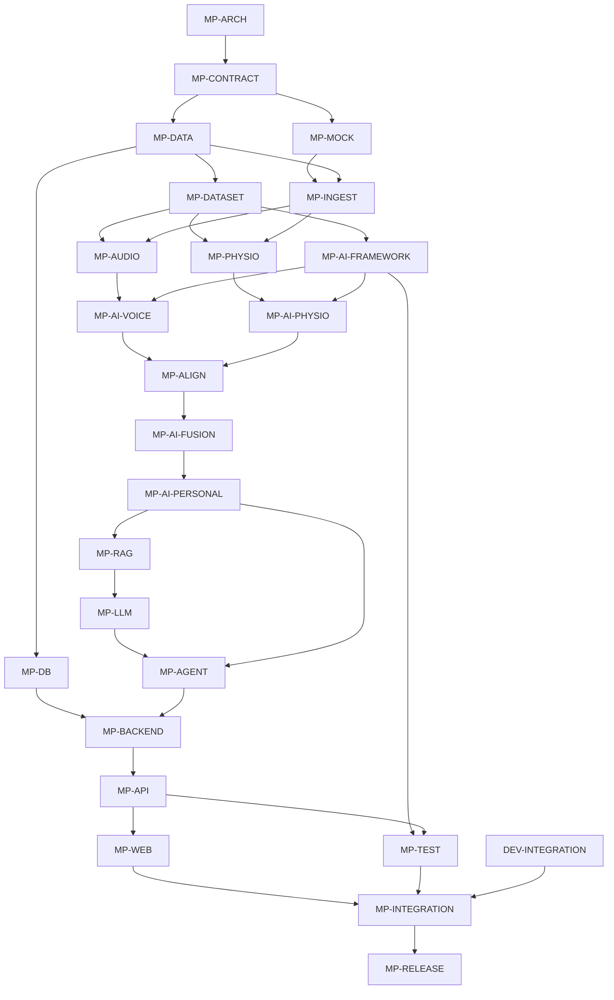
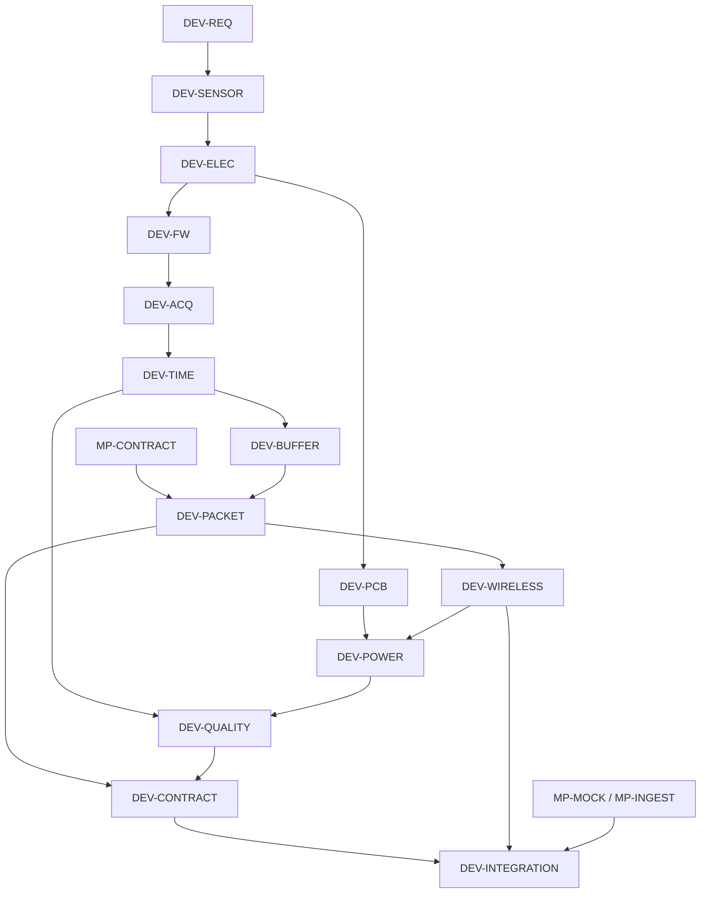
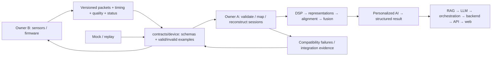

# MindPulse implementation checklist

## Scope and current state

This is the dependency-ordered implementation backlog for **MindPulse-Personalized-Multimodal-Mental-Wellness-Edge-AI**.
The repository is intentionally a **code-free skeleton**. This checklist contains planning content;
source files, schemas, configuration files and other documentation remain empty placeholders.
An existing filename does not mean its task is implemented. All implementation tasks below are open.
Paths marked **planned** name exact files to create during that task; they are not implemented now.
Empty `.gitkeep` files only preserve empty directories in Git and should be removed when real files occupy them.

Only three responsibilities belong here: MindPulse IT/AI, MindPulse Device/Hardware/Firmware,
and their shared interface under `contracts/device/`. Generic infrastructure belongs to the
independent **General-AI-Platform** repository. Consume it through HTTP, SQL, object storage APIs,
vector database APIs, container deployment interfaces, generic GPU runtimes or model-serving endpoints.
Do not implement generic database provisioning, orchestration clusters, GPU infrastructure or a platform here.
Application database schemas, application migrations, MindPulse adapters and deployment requirements belong here.

**Owner A — MindPulse IT / AI Engineer:** data engineering/ingestion, dataset engineering, audio and
physiological DSP, ML/DL research, representations, model benchmarking, multimodal alignment/fusion,
personalization, anomalies/deviations/trends, RAG, LLM, AI orchestration, backend, application database,
API, web and software integration.

**Owner B — Device / Hardware / Firmware Team:** requirements, sensor evaluation, electronics,
PCB, MCU/firmware, signal acquisition, sampling, timestamps/synchronization, buffering,
packetization, wireless transport, power and device validation.

Each task names its accountable owner and any required reviewer. Contract changes require both owners.
Real GitHub team/user assignments are not assumed; use confirmed handles when implementing CODEOWNERS.

## Branch policy

`main` is the stable integration branch. Never develop directly on `main`. Start a local task branch
from the current integrated base, commit the task there, and submit a reviewed integration change.
Do not rewrite published history or force-push. Do not commit secrets, raw personal recordings or model weights.
The current skeleton/checklist work belongs to `project/architecture`; the user's explicit push request
authorizes publishing that branch only, not creating every branch listed below.

To create any branch locally: fetch the integration branch, then run `git switch -c <branch> origin/main`.
For dependent work that has not merged, agree on its base branch first. Do not run remote branch creation
commands as part of scaffold setup. Publish an individual branch only when explicitly requested/authorized.

Project branches: `project/architecture`, `project/data-contract`, `project/dataset-pipeline`,
`project/mock-device`, `project/data-ingestion`, `project/data-model`, `project/voice-dsp`,
`project/physio-dsp`, `project/multimodal-alignment`, `project/ai-framework`, `project/voice-models`,
`project/physio-models`, `project/multimodal`, `project/personalization`, `project/rag`, `project/llm`,
`project/agent`, `project/database`, `project/backend`, `project/api`, `project/web`, `project/integration-tests`.

Device branches: `device/requirements`, `device/sensor-evaluation`, `device/electronics`, `device/pcb`,
`device/firmware`, `device/acquisition`, `device/synchronization`, `device/buffering`,
`device/packetization`, `device/wireless`, `device/power`, `device/quality`, `device/validation`.

## Dependency diagrams

The detailed Dependencies field is authoritative. The diagrams summarize the main paths.
Device tasks and mock-driven software work can proceed concurrently after contract agreement.

### MindPulse dependency graph

### Device dependency graph

### Project ↔ Device contract

## Foundation and shared contract

### MP-ARCH

- [ ] **MP-ARCH-001 — Establish ownership, architecture and repository governance**

  **Domain:** Project architecture and integration governance.
  **Owner:** Owner A; Owner B reviews the device and contract boundary.
  **Recommended branch:** `project/architecture`.
  **Exact folder:** `/`, `.github/`, `docs/architecture/`, `docs/migration/`, `docs/integration/`.
  **Exact file(s):** `README.md`, `TASK_CHECKLIST.md`, `pyproject.toml`, `.gitignore`, `.env.example`, `.github/CODEOWNERS`, `.github/pull_request_template.md`, `docs/architecture/SYSTEM_ARCHITECTURE.md`, `docs/architecture/DATA_FLOW.md`, `docs/architecture/AI_PIPELINE.md`, `docs/architecture/SOFTWARE_BOUNDARIES.md`, `docs/migration/REPOSITORY_AUDIT.md`, `docs/migration/MIGRATION_PLAN.md`, `docs/migration/REFACTOR_REPORT.md`, `docs/integration/END_TO_END_FLOW.md`.
  **Objective:** Establish an auditable MindPulse-specific architecture with separate project/device ownership.
  **Input:** Approved scope, target tree, existing Git history and this skeleton-only instruction.
  **Detailed work steps:** (1) Audit paths, meaningful content, imports, tests and Git state. (2) Classify important files as KEEP/MOVE/REFACTOR/DEPRECATE/REMOVE_ONLY_IF_SAFE with path, target, reason and risk. (3) Document the full device-to-web workflow and external platform interfaces. (4) Configure package metadata, ignore policy, placeholder owners and PR checks when implementation begins. (5) Record verification results and unresolved work without claiming placeholders are implemented.
  **Expected output:** Reviewed architecture, repository rules, migration evidence and actionable checklist.
  **Acceptance criteria:** Both owners agree on responsibilities; all required tree paths are present; main remains stable; generic platform implementation is absent; documentation distinguishes planned and implemented capabilities.
  **Dependencies:** None.
  **Notes:** Only the checklist is populated in the current delivery. Other documentation/configuration content is deferred by the user's skeleton-only instruction. No automatic creation of the branch catalog.

### DEV-REQ

- [ ] **DEV-REQ-001 — Define measurable acquisition and integration requirements**

  **Domain:** Device requirements.
  **Owner:** Owner B; Owner A approves signal and software interface needs.
  **Recommended branch:** `device/requirements`.
  **Exact folder:** `device/specifications/`, `docs/device/`.
  **Exact file(s):** `device/specifications/requirements.md` (planned), `docs/device/DEVICE_BOUNDARY.md`, `docs/device/SIGNAL_REQUIREMENTS.md`.
  **Objective:** Translate project needs into measurable hardware/firmware requirements.
  **Input:** MP-ARCH-001, intended usage, signal modalities and deployment constraints.
  **Detailed work steps:** (1) Define audio/PPG units, ranges, sampling-rate candidates and channel layouts. (2) Specify clock reference, timestamp precision, permitted loss and synchronization budget. (3) Allocate buffering, latency, power and connectivity budgets. (4) Separate required observations from optional device-derived health metrics. (5) Map each requirement to a validation method and owner.
  **Expected output:** Versioned requirements and a traceable validation matrix.
  **Acceptance criteria:** Every numerical requirement has units, rationale and a test; unknown values are explicitly unresolved; IT/AI and device responsibilities do not overlap ambiguously.
  **Dependencies:** MP-ARCH-001.
  **Notes:** Sensor choices and rates are candidates until evaluation; do not imply a wellness prototype is medically validated.

### MP-CONTRACT

- [ ] **MP-CONTRACT-001 — Define and validate the shared device contract**

  **Domain:** Project ↔ Device interface.
  **Owner:** Owner A accountable; Owner B co-designs and approves compatibility.
  **Recommended branch:** `project/data-contract`.
  **Exact folder:** `contracts/device/`, `contracts/device/schemas/`, `contracts/device/examples/valid/`, `contracts/device/examples/invalid/`, `tests/contracts/`, `docs/integration/`.
  **Exact file(s):** `contracts/device/README.md`; the six schemas `device_packet.schema.json`, `audio_observation.schema.json`, `ppg_observation.schema.json`, `health_metric.schema.json`, `signal_quality.schema.json`, `device_status.schema.json` under `contracts/device/schemas/`; `contracts/device/examples/valid/audio_packet.json`, `contracts/device/examples/valid/ppg_packet.json`, `contracts/device/examples/valid/health_metric.json`, `contracts/device/examples/valid/signal_quality.json`, `contracts/device/examples/valid/device_status.json`, `contracts/device/examples/invalid/unsupported_version.json`, `contracts/device/examples/invalid/bad_timestamp.json`, `contracts/device/examples/invalid/bad_sample_count.json`, `tests/contracts/test_device_schemas.py` (all example/test files planned); `docs/integration/CONTRACT_WORKFLOW.md`.
  **Objective:** Make the shared contract the authoritative compatibility boundary.
  **Input:** DEV-REQ-001 signal/timing requirements and MP-ARCH-001 boundaries.
  **Detailed work steps:** (1) Specify IDs, schema version, modality, units, encoding, rate, sequence, timebase, sample count and payload bounds. (2) Define quality/status semantics, optional metrics and missingness. (3) Document wire-to-JSON adaptation and version negotiation. (4) Add valid/invalid examples and both schema and cross-field checks. (5) Require both owners to review breaking changes with upgrade/deprecation rules.
  **Expected output:** Six versioned schemas, representative fixtures and executable conformance tests.
  **Acceptance criteria:** Every valid fixture passes; invalid fixtures fail for their intended reason; sample count, timestamps and payload semantics are checked beyond JSON shape; incompatible versions fail explicitly.
  **Dependencies:** MP-ARCH-001, DEV-REQ-001.
  **Notes:** Do not silently conflate a binary wire format with its canonical JSON representation. Schemas are empty placeholders until this task is implemented.

### MP-DATA

- [ ] **MP-DATA-001 — Define canonical observations, sessions and structured AI results**

  **Domain:** Project data model.
  **Owner:** Owner A.
  **Recommended branch:** `project/data-model`.
  **Exact folder:** `project/data/`, `tests/project/`.
  **Exact file(s):** `project/data/models.py`, `tests/project/test_data_models.py` (planned).
  **Objective:** Establish typed internal data flowing from validated packets to AI and application layers.
  **Input:** MP-CONTRACT-001 schemas and the complete software workflow.
  **Detailed work steps:** (1) Define observation/session/window and provenance models. (2) Define representation and modality-mask metadata without fixing embedding sizes. (3) Define structured AI results containing quality, deviation/trend, uncertainty and model/baseline versions. (4) Specify serialization, missing data and monotonic versus UTC timing. (5) Test round trips and invalid cross-field combinations.
  **Expected output:** Canonical models and validation/serialization tests.
  **Acceptance criteria:** Units and timebases are explicit; absent modalities remain absent; model dimensions are metadata; API/LLM consumers can use structured results without raw-signal access.
  **Dependencies:** MP-CONTRACT-001.
  **Notes:** Internal AI/application models are owned by Owner A; device-facing schema changes still need Owner B.

### MP-MOCK

- [ ] **MP-MOCK-001 — Build deterministic mock-device and replay tools**

  **Domain:** Software integration tooling.
  **Owner:** Owner A; Owner B supplies protocol examples.
  **Recommended branch:** `project/mock-device`.
  **Exact folder:** `tools/mock_device/`, `tools/replay/`, `tests/integration/`.
  **Exact file(s):** `tools/mock_device/generator.py`, `tools/mock_device/scenarios.py`, `tools/replay/replay.py`, `tests/integration/test_mock_replay.py` (planned).
  **Objective:** Unblock software development before hardware is available.
  **Input:** MP-CONTRACT-001 valid/invalid fixtures and timing rules.
  **Detailed work steps:** (1) Generate seeded audio/PPG packets with explicit independent rates. (2) Add dropout, corruption, duplicate, out-of-order, clock-reset and low-quality scenarios. (3) Replay recorded contract-valid packets at controlled speed. (4) Record scenario seeds and expected outcomes. (5) Verify bounded execution and deterministic output.
  **Expected output:** Mock/replay command interfaces and reproducible integration fixtures.
  **Acceptance criteria:** Same seed yields equivalent packets; every fault is observable; replay preserves timestamps and version/provenance; no hardware or large model is required.
  **Dependencies:** MP-CONTRACT-001.
  **Notes:** Synthetic data must be labeled synthetic and never reported as human validation evidence.

### MP-DATASET

- [ ] **MP-DATASET-001 — Implement governed dataset engineering and leakage-safe splits**

  **Domain:** Data engineering and research datasets.
  **Owner:** Owner A.
  **Recommended branch:** `project/dataset-pipeline`.
  **Exact folder:** `project/data/datasets/`, `project/data/preprocessing/`, `project/data/splits/`, `project/data/quality/`, `project/data/versioning/`, `tools/dataset_download/`, `docs/research/`.
  **Exact file(s):** `project/data/datasets/manifest.py`, `project/data/preprocessing/pipeline.py`, `project/data/splits/subject_session.py`, `project/data/quality/report.py`, `project/data/versioning/manifest.py`, `tools/dataset_download/download.py`, `tests/project/test_dataset_splits.py` (planned); `docs/research/DATASETS.md`.
  **Objective:** Produce reproducible, licensed, traceable research datasets without subject/session leakage.
  **Input:** MP-DATA-001 models, candidate dataset metadata, access terms and consent constraints.
  **Detailed work steps:** (1) Inventory modalities, labels, demographics, licenses and access restrictions. (2) Build versioned manifests and checksums. (3) Separate raw, processed and derived assets. (4) Define subject/session/time-aware train/validation/test splits. (5) Fit transformations on training data only and generate missingness/quality reports.
  **Expected output:** Dataset catalog, ingestion/preprocessing pipeline, frozen split manifests and provenance.
  **Acceptance criteria:** Split tests detect subject/session overlap; each artifact traces to a permitted source and transform version; held-out data never fits preprocessing; downloads require deliberate dataset selection.
  **Dependencies:** MP-DATA-001.
  **Notes:** No bulk dataset downloads during scaffold work; data artifacts live in external approved storage or ignored local artifacts.

### MP-INGEST

- [ ] **MP-INGEST-001 — Receive, validate, map and reconstruct bounded sessions**

  **Domain:** Project ingestion.
  **Owner:** Owner A.
  **Recommended branch:** `project/data-ingestion`.
  **Exact folder:** `project/ingestion/`, `tests/project/`, `tests/integration/`.
  **Exact file(s):** `project/ingestion/receiver.py`, `project/ingestion/parser.py`, `project/ingestion/validator.py`, `project/ingestion/mapper.py`, `project/ingestion/buffer.py`, `project/ingestion/session.py`, `tests/project/test_ingestion.py`, `tests/integration/test_ingestion_replay.py` (last two planned).
  **Objective:** Convert device/mock streams into validated canonical session data.
  **Input:** MP-CONTRACT-001 packets, MP-DATA-001 models and MP-MOCK-001 scenarios.
  **Detailed work steps:** (1) Receive bounded byte/message streams. (2) Parse framing and validate versions, ranges and consistency. (3) Map into canonical observations. (4) Apply bounded queues, backpressure and explicit overflow policy. (5) Reconstruct sessions with duplicates, gaps, sequence wrap/reset and clock changes handled explicitly. (6) Report rejection reasons and preserve provenance.
  **Expected output:** Testable receiver→parser→validator→mapper→buffer→session pipeline.
  **Acceptance criteria:** Fragmentation/corruption cannot hang or grow memory without bound; duplicate handling is deterministic; rates/timebases are preserved; replay produces expected sessions and explicit loss metadata.
  **Dependencies:** MP-CONTRACT-001, MP-DATA-001, MP-MOCK-001.
  **Notes:** Transport authentication and application authorization are separate from schema validation; never log sensitive raw payloads by default.

## Device implementation track

### DEV-SENSOR

- [ ] **DEV-SENSOR-001 — Evaluate sensor candidates against signal requirements**

  **Domain:** Sensor evaluation.
  **Owner:** Owner B; Owner A reviews DSP suitability.
  **Recommended branch:** `device/sensor-evaluation`.
  **Exact folder:** `device/hardware/`, `device/validation/`.
  **Exact file(s):** `device/hardware/sensor_candidates.md`, `device/validation/sensor_evaluation.md` (planned).
  **Objective:** Choose justified prototype sensors using measurements rather than assumptions.
  **Input:** DEV-REQ-001 sampling, noise, range, latency and power budgets.
  **Detailed work steps:** (1) Compare audio/physiological sensor interfaces and electrical requirements. (2) Measure noise, saturation, motion susceptibility, rate stability and signal availability. (3) Record fixtures, conditions and calibration. (4) Assess procurement and firmware support. (5) Explain prototype selection and unresolved alternatives.
  **Expected output:** Candidate matrix and repeatable sensor evaluation evidence.
  **Acceptance criteria:** Each requirement maps to measured results or a documented gap; Owner A confirms the acquired signal is usable by planned DSP.
  **Dependencies:** DEV-REQ-001.
  **Notes:** INMP441/MAX30102 may be candidates; no unverified hardware winner is assumed.

### DEV-ELEC

- [ ] **DEV-ELEC-001 — Define electronics, pinout and prototype wiring**

  **Domain:** Electronics.
  **Owner:** Owner B.
  **Recommended branch:** `device/electronics`.
  **Exact folder:** `device/hardware/`.
  **Exact file(s):** `device/hardware/bill_of_materials.csv`, `device/hardware/pinout.md`, `device/hardware/wiring.md`, `device/hardware/electrical_budget.md` (planned).
  **Objective:** Provide a reproducible electrical design and safe bring-up specification.
  **Input:** DEV-SENSOR-001 sensor results and DEV-REQ-001 interface/power constraints.
  **Detailed work steps:** (1) Select MCU/interface allocation. (2) Define voltage levels, grounding, pull-ups and decoupling. (3) Check pin conflicts and debug/transport isolation. (4) Calculate current budgets. (5) Review BOM and wiring before prototype power-up.
  **Expected output:** BOM, verified pin map, wiring and electrical budget.
  **Acceptance criteria:** Every connection and supply has a defined level/pin; interface conflicts are resolved; review evidence is recorded.
  **Dependencies:** DEV-SENSOR-001.
  **Notes:** Do not encode speculative GPIO assignments into project software.

### DEV-PCB

- [ ] **DEV-PCB-001 — Design and review the device PCB**

  **Domain:** PCB engineering.
  **Owner:** Owner B.
  **Recommended branch:** `device/pcb`.
  **Exact folder:** `device/hardware/pcb/`, `device/validation/` (PCB subfolder planned).
  **Exact file(s):** `device/hardware/pcb/mindpulse.kicad_sch`, `device/hardware/pcb/mindpulse.kicad_pcb`, `device/validation/pcb_review.md` (planned).
  **Objective:** Translate reviewed electronics into a testable physical board.
  **Input:** DEV-ELEC-001 BOM, pinout and electrical constraints.
  **Detailed work steps:** (1) Capture schematics and footprints. (2) Route power, sensor and clock/communication signals. (3) Add test points and programming access. (4) Run electrical/design-rule checks. (5) Review manufacturability and archive revision-specific outputs.
  **Expected output:** PCB source and review/validation record.
  **Acceptance criteria:** Rule violations are resolved or justified; BOM/netlist agree; fabrication revision and test points are identifiable.
  **Dependencies:** DEV-ELEC-001.
  **Notes:** Fabrication orders are separate actions; do not automatically order hardware.

### DEV-FW

- [ ] **DEV-FW-001 — Establish reproducible MCU firmware and bring-up**

  **Domain:** Firmware foundation.
  **Owner:** Owner B.
  **Recommended branch:** `device/firmware`.
  **Exact folder:** `device/firmware/`, `device/firmware/main/`, `device/docs/` (main subfolder planned).
  **Exact file(s):** `device/firmware/CMakeLists.txt`, `device/firmware/sdkconfig.defaults`, `device/firmware/main/CMakeLists.txt`, `device/firmware/main/app_main.cpp`, `device/firmware/main/Kconfig.projbuild`, `device/docs/BUILD_AND_FLASH.md` (planned).
  **Objective:** Make the selected MCU/SDK build and boot reproducibly.
  **Input:** DEV-ELEC-001 pinout, selected MCU, SDK requirements and DEV-REQ-001 budgets.
  **Detailed work steps:** (1) Pin the SDK/toolchain and target. (2) Define board configuration and boot diagnostics. (3) Add initialization/error paths. (4) Separate binary transport from diagnostic logs. (5) Document build/flash and record a bring-up run.
  **Expected output:** Reproducible firmware build and documented board initialization.
  **Acceptance criteria:** Clean toolchain build succeeds; invalid pin/configuration fails clearly; firmware identifies its version and board revision.
  **Dependencies:** DEV-ELEC-001.
  **Notes:** Firmware and hardware files remain absent/empty until implementation; generic runtime infrastructure is external.

### DEV-ACQ

- [ ] **DEV-ACQ-001 — Acquire independently sampled audio and physiological streams**

  **Domain:** Signal acquisition.
  **Owner:** Owner B.
  **Recommended branch:** `device/acquisition`.
  **Exact folder:** `device/firmware/components/acquisition/`, `device/validation/` (component folder planned).
  **Exact file(s):** `device/firmware/components/acquisition/audio_acquisition.cpp`, `device/firmware/components/acquisition/ppg_acquisition.cpp`, `device/firmware/components/acquisition/acquisition.h`, `device/validation/acquisition_report.md` (planned).
  **Objective:** Deliver correctly sampled raw sensor streams with known units and loss behavior.
  **Input:** DEV-FW-001 runtime, DEV-SENSOR-001 devices and MP-CONTRACT-001 signal layout.
  **Detailed work steps:** (1) Configure sensor buses and DMA/FIFO reads. (2) Preserve channel ordering and sample representation. (3) Track actual counts and sample rates. (4) Detect saturation, read errors and overflow. (5) Compare acquired signals against controlled fixtures.
  **Expected output:** Acquisition components and raw capture evidence.
  **Acceptance criteria:** Measured rates/counts match declared packet metadata within agreed tolerance; losses are observable; audio/PPG are not falsely treated as equal-rate signals.
  **Dependencies:** DEV-FW-001, MP-CONTRACT-001.
  **Notes:** Device acquisition produces observations; research DSP and AI remain Owner A responsibilities.

### DEV-TIME

- [ ] **DEV-TIME-001 — Implement timestamping and synchronization**

  **Domain:** Device timing.
  **Owner:** Owner B; Owner A reviews alignment evidence.
  **Recommended branch:** `device/synchronization`.
  **Exact folder:** `device/firmware/components/acquisition/`, `tests/device/`.
  **Exact file(s):** `device/firmware/components/acquisition/timestamps.cpp`, `device/firmware/components/acquisition/timestamps.h`, `device/firmware/components/acquisition/synchronization.cpp`, `tests/device/test_timestamps.cpp` (planned).
  **Objective:** Give all modalities an explicit shared timing reference with bounded error.
  **Input:** DEV-ACQ-001 streams and DEV-REQ-001 timing budget.
  **Detailed work steps:** (1) Define first-sample timestamp semantics and exclusive interval ends. (2) Model sensor start offsets, clock drift and wrap/reset. (3) Distinguish monotonic device time from UTC metadata. (4) Propagate lost-sample timing. (5) Measure cross-modal synchronization against reference events.
  **Expected output:** Timestamp/synchronization implementation and timing tests.
  **Acceptance criteria:** Monotonicity and overflow behavior are tested; loss does not collapse elapsed time; measured alignment error meets the agreed budget.
  **Dependencies:** DEV-ACQ-001.
  **Notes:** Timestamp arithmetic alone is not proof of hardware synchronization accuracy.

### DEV-BUFFER

- [ ] **DEV-BUFFER-001 — Bound device buffering and specify overflow behavior**

  **Domain:** Device memory and buffering.
  **Owner:** Owner B.
  **Recommended branch:** `device/buffering`.
  **Exact folder:** `device/firmware/components/buffering/`, `tests/device/` (component folder planned).
  **Exact file(s):** `device/firmware/components/buffering/ring_buffer.cpp`, `device/firmware/components/buffering/ring_buffer.h`, `tests/device/test_ring_buffer.cpp` (planned).
  **Objective:** Absorb expected transport stalls within fixed memory budgets.
  **Input:** DEV-TIME-001 timed streams, throughput measurements and RAM/latency budgets.
  **Detailed work steps:** (1) Size queues from worst-case production/consumption rates. (2) Define concurrency ownership and atomicity. (3) Implement explicit drop/backpressure policy. (4) Preserve sequence/loss accounting. (5) Stress wraparound, full/empty and stalled consumers.
  **Expected output:** Bounded buffers, counters and stress-test evidence.
  **Acceptance criteria:** Memory remains bounded; overflow never silently overwrites unreported data; ordering and timestamps survive contention.
  **Dependencies:** DEV-TIME-001.
  **Notes:** Do not promise unlimited offline capture; report the supported stall duration.

### DEV-PACKET

- [ ] **DEV-PACKET-001 — Encode versioned packets and integrity metadata**

  **Domain:** Device packetization.
  **Owner:** Owner B; Owner A reviews decoder compatibility.
  **Recommended branch:** `device/packetization`.
  **Exact folder:** `device/firmware/components/transport/`, `tests/device/`, `contracts/device/examples/valid/`.
  **Exact file(s):** `device/firmware/components/transport/packet_encoder.cpp`, `device/firmware/components/transport/packet_encoder.h`, `tests/device/test_packet_encoder.cpp`, `contracts/device/examples/valid/wire_golden_vectors.json` (planned).
  **Objective:** Produce bounded transport packets interoperable with project ingestion.
  **Input:** MP-CONTRACT-001 framing/version rules and DEV-BUFFER-001 observations/loss counters.
  **Detailed work steps:** (1) Encode channel payloads and metadata with explicit endianness. (2) Bound lengths and validate sample counts. (3) Add defined integrity checks. (4) Specify sequence behavior and status/quality association. (5) Publish byte-exact golden vectors for the project decoder.
  **Expected output:** Encoder and language-independent golden vectors.
  **Acceptance criteria:** Firmware bytes decode to identical canonical observations; corrupt/truncated packets are rejected; version/length limits agree on both sides.
  **Dependencies:** MP-CONTRACT-001, DEV-BUFFER-001.
  **Notes:** Schema evolution requires shared review; CRC/integrity checks are not authentication.

### DEV-WIRELESS

- [ ] **DEV-WIRELESS-001 — Implement device transport and reconnection**

  **Domain:** Device wireless communication.
  **Owner:** Owner B; Owner A reviews receiver behavior.
  **Recommended branch:** `device/wireless`.
  **Exact folder:** `device/firmware/components/connectivity/`, `device/validation/` (component folder planned).
  **Exact file(s):** `device/firmware/components/connectivity/transport.cpp`, `device/firmware/components/connectivity/reconnect.cpp`, `device/validation/wireless_report.md` (planned).
  **Objective:** Deliver device packets with observable reconnect/loss behavior.
  **Input:** DEV-PACKET-001 packets, network constraints and external endpoint specification.
  **Detailed work steps:** (1) Evaluate transport against throughput/power requirements. (2) Implement connection lifecycle, identity and secure credential loading. (3) Add retry/backoff and bounded offline queue interaction. (4) Define replay/duplicate semantics. (5) Test disconnect, congestion and endpoint unavailability.
  **Expected output:** Connectivity component and measured reliability report.
  **Acceptance criteria:** Recovery does not corrupt session ordering; queues stay bounded; credentials are not committed; sustained throughput and loss meet agreed limits.
  **Dependencies:** DEV-PACKET-001.
  **Notes:** Consume standard services; do not build a generic message broker/platform here.

### DEV-POWER

- [ ] **DEV-POWER-001 — Measure and optimize the device power budget**

  **Domain:** Device power.
  **Owner:** Owner B.
  **Recommended branch:** `device/power`.
  **Exact folder:** `device/firmware/components/power/`, `device/validation/` (component folder planned).
  **Exact file(s):** `device/firmware/components/power/power_manager.cpp`, `device/validation/power_budget.md` (planned).
  **Objective:** Meet energy requirements without invalidating signal acquisition or timing.
  **Input:** DEV-PCB-001 board revision and DEV-WIRELESS-001 operational modes.
  **Detailed work steps:** (1) Measure idle, acquisition, transmit and reconnect current. (2) Evaluate duty cycles and sensor/MCU sleep transitions. (3) Measure wake-up timing and signal settling. (4) Estimate runtime with explicit battery assumptions. (5) Recheck packet loss and timestamp continuity.
  **Expected output:** Power-management behavior and measurement-backed energy budget.
  **Acceptance criteria:** Each mode has measured current/duration; projected runtime is reproducible; power changes do not silently break timing or quality requirements.
  **Dependencies:** DEV-PCB-001, DEV-WIRELESS-001.
  **Notes:** Report measurement conditions and uncertainty; do not infer battery life from nominal current alone.

### DEV-QUALITY

- [ ] **DEV-QUALITY-001 — Report acquisition quality and device status**

  **Domain:** Device quality and diagnostics.
  **Owner:** Owner B; Owner A reviews interpretation.
  **Recommended branch:** `device/quality`.
  **Exact folder:** `device/firmware/components/quality/`, `device/validation/` (component folder planned).
  **Exact file(s):** `device/firmware/components/quality/signal_quality.cpp`, `device/firmware/components/quality/device_status.cpp`, `device/validation/quality_report.md` (planned).
  **Objective:** Make device-observable failures and acquisition confidence available to software.
  **Input:** DEV-TIME-001 timing, DEV-POWER-001 operational states and MP-CONTRACT-001 quality/status schemas.
  **Detailed work steps:** (1) Define saturation, sensor disconnect, FIFO loss, clock and battery flags. (2) Associate flags with precise intervals. (3) Distinguish measured quality from unknown quality. (4) Emit contract-valid diagnostics. (5) Inject faults and compare expected flags.
  **Expected output:** Device quality/status messages and fault-validation evidence.
  **Acceptance criteria:** Every injected fault produces the documented signal; unknown is not encoded as good; metadata survives packetization and ingestion.
  **Dependencies:** DEV-TIME-001, DEV-POWER-001, MP-CONTRACT-001.
  **Notes:** Device quality is acquisition evidence; final DSP quality and model confidence are separate Owner A outputs.

### DEV-CONTRACT

- [ ] **DEV-CONTRACT-001 — Prove firmware contract conformance**

  **Domain:** Shared interface conformance from the device side.
  **Owner:** Owner B accountable; Owner A co-reviews decoder results.
  **Recommended branch:** `device/validation`.
  **Exact folder:** `device/validation/`, `tests/device/`, `contracts/device/examples/valid/`.
  **Exact file(s):** `device/validation/contract_conformance.md`, `tests/device/test_contract_conformance.py`, `contracts/device/examples/valid/firmware_capture.json` (planned).
  **Objective:** Demonstrate compatibility using actual firmware output, not just mock data.
  **Input:** DEV-PACKET-001 encoder, DEV-QUALITY-001 diagnostics and MP-CONTRACT-001 fixtures/rules.
  **Detailed work steps:** (1) Capture outputs from an identified firmware build. (2) Validate schema and cross-field semantics after decoding. (3) Compare golden vectors and version handling. (4) Test corruption, reset and maximum payloads. (5) Obtain both owners' review.
  **Expected output:** Versioned firmware conformance evidence and regression fixtures.
  **Acceptance criteria:** Firmware/project versions and board revision are recorded; all supported message families pass; incompatible versions and malformed packets fail explicitly.
  **Dependencies:** DEV-PACKET-001, DEV-QUALITY-001, MP-CONTRACT-001.
  **Notes:** Contract changes must update fixtures and both implementations in coordinated branches.

### DEV-INTEGRATION

- [ ] **DEV-INTEGRATION-001 — Validate device-to-project integration on hardware**

  **Domain:** Device/system integration.
  **Owner:** Owner B accountable; Owner A operates the ingestion side.
  **Recommended branch:** `device/validation`.
  **Exact folder:** `device/validation/`, `docs/device/`, `tests/integration/`.
  **Exact file(s):** `device/validation/integration_report.md`, `docs/device/INTEGRATION_GUIDE.md`, `tests/integration/test_device_to_ingestion.py` (report/test planned).
  **Objective:** Verify realistic device streams arrive as correct canonical sessions.
  **Input:** DEV-CONTRACT-001 conformance evidence, DEV-WIRELESS-001 transport and MP-INGEST-001 pipeline.
  **Detailed work steps:** (1) Document board/build/host configurations. (2) Run nominal and long-duration capture. (3) Induce disconnect, power transition, dropout and reboot. (4) Compare sample counts, timing, gaps and quality end to end. (5) Record limitations and reproducible setup.
  **Expected output:** Hardware integration report and repeatable regression procedure.
  **Acceptance criteria:** Requirement-linked tests pass within stated budgets; failures are visible rather than silently repaired; Owner A can replay the captured contract data.
  **Dependencies:** DEV-CONTRACT-001, DEV-WIRELESS-001, MP-INGEST-001.
  **Notes:** Hardware-dependent tests must declare equipment requirements and cannot be reported as passed when skipped.

## Project signal processing and AI research

### MP-AUDIO

- [ ] **MP-AUDIO-001 — Implement validated audio DSP and quality gates**

  **Domain:** Voice signal processing.
  **Owner:** Owner A.
  **Recommended branch:** `project/voice-dsp`.
  **Exact folder:** `project/signal/audio/`, `tests/project/`.
  **Exact file(s):** `project/signal/audio/validation.py`, `project/signal/audio/preprocessing.py`, `project/signal/audio/vad.py`, `project/signal/audio/framing.py`, `project/signal/audio/stft.py`, `project/signal/audio/mel.py`, `project/signal/audio/quality.py`, `tests/project/test_audio_dsp.py` (test planned).
  **Objective:** Produce reproducible audio representations and quality metadata from canonical windows.
  **Input:** MP-INGEST-001 windows, MP-DATASET-001 manifests and signal requirements.
  **Detailed work steps:** (1) Validate rate, channel layout, range and duration. (2) Define normalization/filtering and resampling policy. (3) Implement VAD, framing, STFT and mel transforms with explicit parameters. (4) Detect clipping, silence and missing/low-quality input. (5) Test synthetic tones, boundaries and short signals.
  **Expected output:** Audio feature pipeline and quality-gated outputs with transform provenance.
  **Acceptance criteria:** Known signals produce expected frequency/frame behavior; empty/invalid data is rejected; preprocessing fits no held-out statistics; timestamps remain traceable.
  **Dependencies:** MP-INGEST-001, MP-DATASET-001.
  **Notes:** DSP parameters are research configuration, not a locked voice model.

### MP-PHYSIO

- [ ] **MP-PHYSIO-001 — Implement physiological DSP, intervals and variability features**

  **Domain:** Physiological signal processing.
  **Owner:** Owner A.
  **Recommended branch:** `project/physio-dsp`.
  **Exact folder:** `project/signal/physiological/`, `tests/project/`.
  **Exact file(s):** `project/signal/physiological/validation.py`, `project/signal/physiological/preprocessing.py`, `project/signal/physiological/filtering.py`, `project/signal/physiological/artifacts.py`, `project/signal/physiological/quality.py`, `project/signal/physiological/peaks.py`, `project/signal/physiological/ibi.py`, `project/signal/physiological/hrv.py`, `tests/project/test_physiological_dsp.py` (test planned).
  **Objective:** Extract quality-aware pulse timing/features without inventing valid data across gaps.
  **Input:** MP-INGEST-001 physiological windows, MP-DATASET-001 datasets and device units/rates.
  **Detailed work steps:** (1) Validate channel/rate/units and coverage. (2) Implement configurable baseline removal and filtering. (3) Detect artifacts and mark invalid intervals. (4) Extract peaks and inter-beat intervals with physiological plausibility checks. (5) Compute eligible variability features with minimum-duration rules and test synthetic/reference traces.
  **Expected output:** Physiological features, interval masks and quality reports.
  **Acceptance criteria:** Known peak intervals recover within declared tolerance; gaps/artifacts are not treated as normal beats; insufficient coverage returns unavailable features; feature provenance is retained.
  **Dependencies:** MP-INGEST-001, MP-DATASET-001.
  **Notes:** PPG-derived pulse-rate variability must be labeled as PRV where appropriate; do not imply ECG-equivalent HRV validation from a filename.

### MP-AI-FRAMEWORK

- [ ] **MP-AI-FRAMEWORK-001 — Implement candidate registry and reproducible experiment interfaces**

  **Domain:** MindPulse AI research framework.
  **Owner:** Owner A.
  **Recommended branch:** `project/ai-framework`.
  **Exact folder:** `project/ai/registry/`, `project/ai/experiments/`, `project/ai/experiments/configs/`, `tools/benchmark/`, `tests/project/`.
  **Exact file(s):** `project/ai/registry/candidates.py`, `project/ai/registry/interfaces.py`, `project/ai/experiments/configs/baseline.yaml`, `tools/benchmark/run.py`, `tests/project/test_experiment_registry.py` (planned); `project/ai/experiments/runner.py`, `project/ai/experiments/metrics.py`, `project/ai/experiments/tracking.py`, `project/ai/experiments/benchmark.py`.
  **Objective:** Allow interchangeable candidates, trainers, evaluators and benchmarks without choosing final models.
  **Input:** MP-DATASET-001 frozen splits/provenance and MP-DATA-001 model interfaces.
  **Detailed work steps:** (1) Define candidate metadata, capabilities and construction interfaces. (2) Register model families and explicit hyperparameters. (3) Define train/evaluate contracts and deterministic seeds. (4) Track dataset/config/code versions and artifacts. (5) Benchmark task metrics, calibration, latency, memory and missingness robustness using identical splits. (6) Test with tiny dummy candidates.
  **Expected output:** Registry, experiment runner, metric/tracking interfaces and benchmark reports.
  **Acceptance criteria:** Adding a candidate requires no pipeline rewrite; comparisons use the same split/evaluation protocol; failed runs remain visible; dimensions and model endpoints are configurable.
  **Dependencies:** MP-DATASET-001, MP-DATA-001.
  **Notes:** This is MindPulse-specific experiment logic, not a generic training/GPU platform. No large-model download or training during refactor.

### MP-AI-VOICE

- [ ] **MP-AI-VOICE-001 — Evaluate voice representation candidates**

  **Domain:** Voice ML/DL research.
  **Owner:** Owner A.
  **Recommended branch:** `project/voice-models`.
  **Exact folder:** `project/ai/voice/`, `project/ai/voice/candidates/`, `docs/research/`.
  **Exact file(s):** `project/ai/voice/candidates/cnn_crnn.py`, `project/ai/voice/candidates/pretrained_audio.py` (planned); `project/ai/voice/trainer.py`, `project/ai/voice/evaluator.py`, `docs/research/VOICE_MODEL_CANDIDATES.md`.
  **Objective:** Compare voice representations under a reproducible protocol.
  **Input:** MP-AUDIO-001 features/waveforms, MP-AI-FRAMEWORK-001 registry and MP-DATASET-001 splits.
  **Detailed work steps:** (1) Register CNN/CRNN baselines and candidate adapters for wav2vec 2.0, HuBERT, WavLM, AST and BEATs. (2) Document input, licensing and resource requirements. (3) Implement controlled training/fine-tuning interfaces. (4) Evaluate held-out subjects/sessions and noise/quality slices. (5) Report task utility and edge/resource tradeoffs.
  **Expected output:** Candidate adapters, trainer/evaluator and comparison evidence.
  **Acceptance criteria:** All candidates expose versioned embeddings and declared dimensions; benchmark splits are identical; unavailable candidates are labeled untested; no winner is hard-coded into downstream code.
  **Dependencies:** MP-AUDIO-001, MP-AI-FRAMEWORK-001.
  **Notes:** Future justified models are welcome; pretrained weights must not be downloaded automatically during setup/refactor.

### MP-AI-PHYSIO

- [ ] **MP-AI-PHYSIO-001 — Evaluate physiological representation candidates**

  **Domain:** Physiological ML/DL research.
  **Owner:** Owner A.
  **Recommended branch:** `project/physio-models`.
  **Exact folder:** `project/ai/physiological/`, `project/ai/physiological/candidates/`, `docs/research/`.
  **Exact file(s):** `project/ai/physiological/candidates/convolutional.py`, `project/ai/physiological/candidates/temporal.py`, `project/ai/physiological/candidates/self_supervised.py` (planned); `project/ai/physiological/trainer.py`, `project/ai/physiological/evaluator.py`, `docs/research/PHYSIO_MODEL_CANDIDATES.md`.
  **Objective:** Compare physiological features/representations across signal quality and subject variation.
  **Input:** MP-PHYSIO-001 signals/features and MP-AI-FRAMEWORK-001 research interfaces.
  **Detailed work steps:** (1) Register 1D CNN, ResNet1D, TCN, GRU/LSTM, Transformer, PatchTST, TimesNet and self-supervised families. (2) Specify input duration, normalization and masks. (3) Implement training interfaces using leakage-safe splits. (4) Evaluate task utility and artifact/missingness robustness. (5) Report compute/memory and calibration.
  **Expected output:** Candidate implementations/adapters and reproducible comparison reports.
  **Acceptance criteria:** Subject/session leakage tests pass; variable dimensions are declared; low-quality signals do not become confident normal predictions; comparisons include simple baselines.
  **Dependencies:** MP-PHYSIO-001, MP-AI-FRAMEWORK-001.
  **Notes:** No final physiological model is locked; future candidates need a documented hypothesis and comparable evaluation.

### MP-ALIGN

- [ ] **MP-ALIGN-001 — Align multimodal representations and missingness masks**

  **Domain:** Multimodal time alignment.
  **Owner:** Owner A; Owner B reviews clock assumptions.
  **Recommended branch:** `project/multimodal-alignment`.
  **Exact folder:** `project/ai/fusion/`, `tests/project/`.
  **Exact file(s):** `project/ai/fusion/alignment.py`, `project/ai/fusion/modality_mask.py`, `tests/project/test_multimodal_alignment.py` (test planned).
  **Objective:** Pair eligible representations by physical time and expose unavailable modalities explicitly.
  **Input:** MP-AI-VOICE-001 and MP-AI-PHYSIO-001 embeddings with intervals, quality and provenance.
  **Detailed work steps:** (1) Define window overlap and tolerance rules. (2) Align different rates/window durations by timestamps. (3) Carry clock uncertainty and quality into eligibility. (4) Emit modality masks for absent/rejected data. (5) Test gaps, lag, boundary rounding and complete dropout.
  **Expected output:** Time-aligned multimodal batches with masks and provenance.
  **Acceptance criteria:** Known offsets yield expected pairings; no future-window leakage occurs; missing data is never silently zero-filled as valid; tolerance changes are configurable and tested.
  **Dependencies:** MP-AI-VOICE-001, MP-AI-PHYSIO-001.
  **Notes:** Do not require equal sensor sampling rates or a fixed concatenated dimension.

### MP-AI-FUSION

- [ ] **MP-AI-FUSION-001 — Benchmark fusion families and modality ablations**

  **Domain:** Multimodal learning.
  **Owner:** Owner A.
  **Recommended branch:** `project/multimodal`.
  **Exact folder:** `project/ai/fusion/`, `project/ai/fusion/candidates/`, `docs/research/`.
  **Exact file(s):** `project/ai/fusion/candidates/concatenation.py`, `project/ai/fusion/candidates/mlp.py`, `project/ai/fusion/candidates/gated.py`, `project/ai/fusion/candidates/attention.py`, `project/ai/fusion/trainer.py` (planned); `project/ai/fusion/evaluator.py`, `docs/research/FUSION_MODEL_CANDIDATES.md`.
  **Objective:** Test whether combining modalities improves MindPulse outcomes under realistic missingness.
  **Input:** MP-ALIGN-001 aligned batches/masks and MP-AI-FRAMEWORK-001 benchmark protocol.
  **Detailed work steps:** (1) Register concatenation, MLP, gated, attention and cross-attention candidates. (2) Fit normalization only on training splits. (3) Train/evaluate with explicit modality masks. (4) Compare single-modality, quality-weighted and missing-modality ablations. (5) Report performance/resource tradeoffs and confidence intervals where justified.
  **Expected output:** Configurable fusion candidates and ablation benchmark results.
  **Acceptance criteria:** Every model handles declared mask combinations; no hard-coded 96-dimensional requirement exists; claimed improvements are supported by held-out evidence and baseline comparison.
  **Dependencies:** MP-ALIGN-001, MP-AI-FRAMEWORK-001.
  **Notes:** Keep future multimodal architectures pluggable; an experiment result does not permanently select a winner.

### MP-AI-PERSONAL

- [ ] **MP-AI-PERSONAL-001 — Evaluate personalization, anomaly and trend modeling**

  **Domain:** Personalized AI and deviation modeling.
  **Owner:** Owner A.
  **Recommended branch:** `project/personalization`.
  **Exact folder:** `project/ai/personalization/`, `project/ai/personalization/baselines/`, `project/ai/personalization/anomaly/`, `docs/research/`.
  **Exact file(s):** `project/ai/personalization/baselines/statistical.py`, `project/ai/personalization/anomaly/candidates.py`, `project/ai/personalization/evaluator.py`, `project/ai/personalization/trends.py` (planned); `project/ai/personalization/calibration.py`, `project/ai/personalization/adaptation.py`, `project/ai/personalization/drift.py`, `docs/research/PERSONALIZATION_CANDIDATES.md`.
  **Objective:** Generate calibrated personal deviations/trends with safe, auditable baseline updates.
  **Input:** MP-AI-FUSION-001 outputs, historical quality-approved sessions and MP-DATA-001 structured result schema.
  **Detailed work steps:** (1) Register statistical baselines, Z-score, Mahalanobis, Isolation Forest, One-Class SVM, Autoencoder, VAE and Deep SVDD candidates. (2) Define cold-start and minimum-history rules. (3) Calibrate on appropriate historical partitions. (4) Gate adaptation by quality/consent and prevent anomaly contamination. (5) Detect drift and evaluate false alarms, uncertainty and trends.
  **Expected output:** Baseline/anomaly candidates and versioned structured AI results.
  **Acceptance criteria:** Updates are reversible/auditable; future data does not influence earlier baselines; low coverage yields abstention; personalized performance is compared with non-personalized baselines.
  **Dependencies:** MP-AI-FUSION-001, MP-AI-FRAMEWORK-001.
  **Notes:** Scores indicate deviation within the research protocol, not a medical diagnosis. Model families remain candidates.

## Intelligence and application track

### MP-RAG

- [ ] **MP-RAG-001 — Build grounded retrieval for structured AI results**

  **Domain:** MindPulse retrieval-augmented generation.
  **Owner:** Owner A.
  **Recommended branch:** `project/rag`.
  **Exact folder:** `project/intelligence/rag/`, `docs/research/`, `tests/project/`.
  **Exact file(s):** `project/intelligence/rag/ingestion.py`, `project/intelligence/rag/retrieval.py`, `project/intelligence/rag/context.py`, `project/intelligence/rag/evaluator.py`, `tests/project/test_rag_grounding.py` (planned); `docs/research/LLM_RAG_CANDIDATES.md`.
  **Objective:** Retrieve relevant, permitted wellness context with traceable sources.
  **Input:** MP-AI-PERSONAL-001 structured results and curated documents with provenance/access rules.
  **Detailed work steps:** (1) Define document approval/versioning and chunking. (2) Evaluate embedding/retrieval candidates through standard vector APIs. (3) Build context from allowed result fields and retrieved passages. (4) Carry source IDs/citations and access filters. (5) Evaluate retrieval relevance, stale sources and no-evidence behavior.
  **Expected output:** Ingestion/retrieval/context components and a grounding evaluation set.
  **Acceptance criteria:** Every context passage has source/version metadata; unauthorized content is excluded; absent evidence triggers an explicit fallback; retrieval quality is measured separately from generation.
  **Dependencies:** MP-AI-PERSONAL-001.
  **Notes:** Vector database hosting is external. Do not include raw personal signals in prompts by default.

### MP-LLM

- [ ] **MP-LLM-001 — Evaluate interchangeable local LLM families**

  **Domain:** LLM evaluation and generation adapters.
  **Owner:** Owner A.
  **Recommended branch:** `project/llm`.
  **Exact folder:** `project/intelligence/llm/`, `docs/research/`, `tests/project/`.
  **Exact file(s):** `project/intelligence/llm/client.py`, `project/intelligence/llm/prompts.py`, `project/intelligence/llm/evaluator.py`, `tests/project/test_llm_outputs.py` (planned); `docs/research/LLM_RAG_CANDIDATES.md`.
  **Objective:** Produce grounded explanations through configurable local model endpoints.
  **Input:** MP-RAG-001 context/citations and MP-AI-PERSONAL-001 structured results.
  **Detailed work steps:** (1) Define provider-neutral request/response interfaces. (2) Compare multiple local model families with documented licenses and runtime budgets. (3) Define output schema, citation and uncertainty requirements. (4) Evaluate grounding, unsupported claims, prompt injection, language quality and latency. (5) Provide timeout/unavailable-model fallbacks.
  **Expected output:** Replaceable model clients, prompt versions and an evaluation matrix.
  **Acceptance criteria:** Switching a candidate needs configuration, not application rewrites; invalid/ungrounded outputs are rejected or safely degraded; test runs can use small deterministic stubs.
  **Dependencies:** MP-RAG-001.
  **Notes:** No final model lock or large downloads during refactor. Generic serving/GPU runtime belongs to General-AI-Platform.

### MP-AGENT

- [ ] **MP-AGENT-001 — Orchestrate the structured AI, retrieval and explanation workflow**

  **Domain:** MindPulse AI orchestration.
  **Owner:** Owner A.
  **Recommended branch:** `project/agent`.
  **Exact folder:** `project/intelligence/orchestration/`, `tests/project/`.
  **Exact file(s):** `project/intelligence/orchestration/workflow.py`, `project/intelligence/orchestration/policy.py`, `project/intelligence/orchestration/state.py`, `tests/project/test_orchestration.py` (planned).
  **Objective:** Coordinate a bounded, observable application workflow with explicit failure states.
  **Input:** MP-AI-PERSONAL-001 results, MP-RAG-001 retrieval and MP-LLM-001 generation interfaces.
  **Detailed work steps:** (1) Define typed workflow states and permitted actions. (2) Gate actions on consent, quality and uncertainty. (3) Add retry/time budgets and idempotency. (4) Record model, baseline, retrieval and prompt versions. (5) Test failure recovery and fallback explanations.
  **Expected output:** Domain-specific orchestration service and state-transition tests.
  **Acceptance criteria:** Retries cannot create duplicate actions; unavailable services terminate predictably; low-quality data never silently produces confident guidance; every outcome is traceable.
  **Dependencies:** MP-AI-PERSONAL-001, MP-RAG-001, MP-LLM-001.
  **Notes:** Do not build a generic agent platform or allow unbounded autonomous tool execution.

### MP-DB

- [ ] **MP-DB-001 — Define the MindPulse application database schema**

  **Domain:** Application persistence.
  **Owner:** Owner A.
  **Recommended branch:** `project/database`.
  **Exact folder:** `project/backend/database/`, `project/backend/repositories/`, `tests/integration/`.
  **Exact file(s):** `project/backend/database/models.py`, `project/backend/database/session.py`, `project/backend/database/migrations/0001_initial.py`, `project/backend/repositories/sessions.py`, `project/backend/repositories/results.py`, `tests/integration/test_database.py` (planned).
  **Objective:** Persist application users, devices, sessions, consent, measurements and AI provenance.
  **Input:** MP-DATA-001 canonical entities, retention/access policy and an external SQL service interface.
  **Detailed work steps:** (1) Define keys, relationships, constraints and indexes. (2) Separate large signal assets from metadata via object references. (3) Implement migration/rollback policy. (4) Build repository transactions and idempotency. (5) Test authorization scoping, deletion/retention and concurrent writes.
  **Expected output:** Application schema, migrations and repository integration tests.
  **Acceptance criteria:** Clean migrations and supported upgrade paths pass; results link to model/baseline versions; data isolation and retention rules are enforced; no credentials are hard-coded.
  **Dependencies:** MP-DATA-001.
  **Notes:** SQL server provisioning, backups-as-platform and database infrastructure are outside this repository.

### MP-BACKEND

- [ ] **MP-BACKEND-001 — Implement application services and authentication boundaries**

  **Domain:** Backend application.
  **Owner:** Owner A.
  **Recommended branch:** `project/backend`.
  **Exact folder:** `project/backend/`, `project/backend/services/`, `project/backend/auth/`, `tests/project/`.
  **Exact file(s):** `project/backend/main.py`; `project/backend/services/ingestion.py`, `project/backend/services/results.py`, `project/backend/services/consent.py`, `project/backend/auth/dependencies.py`, `tests/project/test_backend_services.py` (planned).
  **Objective:** Expose domain services that coordinate persistence and intelligence safely.
  **Input:** MP-DB-001 repositories and MP-AGENT-001 orchestration interface.
  **Detailed work steps:** (1) Define application startup/configuration and dependency injection. (2) Implement authenticated device/user boundaries. (3) Add consent-aware session/result services. (4) Define error handling, transactions and background-work interfaces. (5) Test cross-user isolation and dependency outages.
  **Expected output:** Backend application entrypoint and tested services.
  **Acceptance criteria:** Unauthorized access fails; service errors do not expose sensitive payloads; retries remain idempotent; external infrastructure is consumed through adapters.
  **Dependencies:** MP-DB-001, MP-AGENT-001.
  **Notes:** Avoid coupling route handlers directly to training code or hardware drivers.

### MP-API

- [ ] **MP-API-001 — Publish versioned application APIs and response schemas**

  **Domain:** Application API.
  **Owner:** Owner A.
  **Recommended branch:** `project/api`.
  **Exact folder:** `project/backend/api/v1/`, `project/backend/schemas/`, `tests/integration/`.
  **Exact file(s):** `project/backend/api/v1/router.py`, `project/backend/api/v1/sessions.py`, `project/backend/api/v1/results.py`, `project/backend/api/v1/feedback.py`, `project/backend/schemas/session.py`, `project/backend/schemas/result.py`, `tests/integration/test_api.py` (planned).
  **Objective:** Provide stable contracts for web and software integration.
  **Input:** MP-BACKEND-001 services and MP-DATA-001 canonical results.
  **Detailed work steps:** (1) Define request/response validation and API versioning. (2) Add session/result/history/feedback routes as agreed. (3) Specify pagination, timestamps, idempotency and error codes. (4) Publish an API specification. (5) Test authorization, malformed input and compatible evolution.
  **Expected output:** Versioned API routes, schemas and contract tests.
  **Acceptance criteria:** API specifications match runtime behavior; unauthorized cross-user requests fail; missing/low-confidence states are explicit; backend internals do not leak into responses.
  **Dependencies:** MP-BACKEND-001.
  **Notes:** Application API contracts are separate from device packet schemas under contracts/device/.

### MP-WEB

- [ ] **MP-WEB-001 — Implement the MindPulse web application**

  **Domain:** Web application.
  **Owner:** Owner A.
  **Recommended branch:** `project/web`.
  **Exact folder:** `web/`, `web/src/`, `web/tests/` (subfolders planned).
  **Exact file(s):** `web/package.json`, `web/src/App.tsx`, `web/src/api/client.ts`, `web/src/pages/Dashboard.tsx`, `web/src/pages/Session.tsx`, `web/src/pages/Consent.tsx`, `web/tests/user_flows.spec.ts` (planned).
  **Objective:** Present sessions, trends, explanations and consent in a usable application.
  **Input:** MP-API-001 specification and approved user journeys/visual requirements.
  **Detailed work steps:** (1) Select and document the frontend toolchain. (2) Implement typed API access and authentication flow. (3) Build session/history, quality/uncertainty, grounded explanation and consent views. (4) Add loading, empty, offline and error states. (5) Test accessibility and critical user journeys.
  **Expected output:** Web application and end-to-end UI tests.
  **Acceptance criteria:** Views reflect actual API states; users can distinguish unavailable/uncertain results; citations are navigable; consent changes are honored; critical paths work with keyboard navigation.
  **Dependencies:** MP-API-001.
  **Notes:** Listed TSX paths are a concrete planned convention, not installed tooling. Keep secrets and raw recordings out of frontend bundles.

## Verification and release

### MP-TEST

- [ ] **MP-TEST-001 — Establish layered contract, project and integration checks**

  **Domain:** Software verification.
  **Owner:** Owner A; Owner B maintains device-specific checks.
  **Recommended branch:** `project/integration-tests`.
  **Exact folder:** `tests/contracts/`, `tests/project/`, `tests/device/`, `tests/integration/`, `.github/workflows/` (workflow folder planned).
  **Exact file(s):** `tests/contracts/test_device_schemas.py`, `tests/project/test_pipeline_failures.py`, `tests/integration/test_service_boundaries.py`, `.github/workflows/python-tests.yml`, `.github/workflows/firmware-build.yml` (planned); `pyproject.toml`.
  **Objective:** Verify behavioral contracts and failure modes without overstating test coverage.
  **Input:** MP-AI-FRAMEWORK-001 interfaces, MP-API-001 application boundaries and earlier module tests.
  **Detailed work steps:** (1) Define unit/contract/integration/device test responsibilities. (2) Add fixtures for corruption, timing gaps, missing modalities and service outages. (3) Configure applicable lint/type/test checks. (4) Separate lightweight CI from opt-in hardware/model evaluation. (5) Report executed, skipped and unavailable checks accurately.
  **Expected output:** Reproducible check commands and CI evidence.
  **Acceptance criteria:** Import/package checks pass; tests fail on deliberate contract violations; normal CI needs no large downloads; hardware skips are explicit; secrets and personal data are absent from fixtures.
  **Dependencies:** MP-AI-FRAMEWORK-001, MP-API-001.
  **Notes:** Module tests should be written with each implementation task, not postponed until this milestone. Empty scaffold files cannot yield meaningful runtime tests.

### MP-INTEGRATION

- [ ] **MP-INTEGRATION-001 — Verify the complete device/mock-to-web workflow**

  **Domain:** End-to-end system integration.
  **Owner:** Owner A accountable; Owner B co-validates hardware runs.
  **Recommended branch:** `project/integration-tests`.
  **Exact folder:** `tests/integration/`, `docs/integration/`, `artifacts/`.
  **Exact file(s):** `tests/integration/test_end_to_end.py`, `artifacts/integration_report.md` (planned); `docs/integration/END_TO_END_FLOW.md`.
  **Objective:** Demonstrate the complete intended workflow with traceable evidence.
  **Input:** MP-WEB-001 application, MP-TEST-001 checks and DEV-INTEGRATION-001 hardware evidence.
  **Detailed work steps:** (1) Run device/mock → ingestion → parsing → validation → canonical mapping → session reconstruction → data engineering → DSP → representation → alignment → fusion → personalized AI → anomaly/deviation/trend → structured result → RAG → LLM → orchestration → backend → API → web. (2) Trace one session through all stages. (3) Repeat with low quality, missing modalities and unavailable services. (4) Measure latency/loss/resource budgets. (5) Record actual versions and known limitations.
  **Expected output:** End-to-end tests, an integration guide and reproducible evidence.
  **Acceptance criteria:** The nominal run reaches the web with correct provenance; failure scenarios degrade explicitly; hardware and mock results are distinguished; no silent data loss or unsupported AI claims pass unnoticed.
  **Dependencies:** MP-WEB-001, MP-TEST-001, DEV-INTEGRATION-001.
  **Notes:** Mock-based checks can start earlier; full hardware acceptance waits for DEV-INTEGRATION-001.

### MP-RELEASE

- [ ] **MP-RELEASE-001 — Prepare a reviewed stable integration release**

  **Domain:** Release and repository integration.
  **Owner:** Owner A accountable; Owner B signs off device/contract compatibility.
  **Recommended branch:** `project/integration-tests` for release fixes; merge reviewed work into `main`.
  **Exact folder:** `/`, `docs/migration/`, `docs/integration/`, `.github/`.
  **Exact file(s):** `README.md`, `TASK_CHECKLIST.md`, `.github/pull_request_template.md`, `docs/migration/REFACTOR_REPORT.md`, `docs/integration/RELEASE_CHECKLIST.md` (release checklist planned).
  **Objective:** Release only a verified, documented integration state.
  **Input:** MP-INTEGRATION-001 evidence, all mandatory task acceptance results and known limitations.
  **Detailed work steps:** (1) Reconcile checklist status with actual evidence. (2) Review final tree, changed/moved/deprecated files and dependencies. (3) Run applicable tests/lint/types/builds and secret checks. (4) Document external platform requirements and reproducible startup. (5) Obtain both domain reviews, merge through the agreed process and publish release metadata only when authorized.
  **Expected output:** Reviewable release change, final report and stable integrated revision.
  **Acceptance criteria:** Mandatory checks pass or explicit approved exclusions are documented; no secrets/large data/model artifacts are committed; incompatible firmware/software combinations are documented; main receives only reviewed integration changes.
  **Dependencies:** MP-INTEGRATION-001 and acceptance of all mandatory tasks above.
  **Notes:** This checklist/skeleton publication is not an application release. No force-push, history rewrite, direct feature development on main or automatic mass remote-branch creation.

## Completion evidence convention

When a task is actually finished, change only its checkbox to checked and append the commit/PR,
test command/result, artifact location and reviewer evidence below that task. Do not mark a task complete
because an empty file, planned path, model name or branch exists. Subsequent tasks may begin with
documented stubs, but final acceptance requires the listed dependencies to satisfy their criteria.

First recommended local work branches: `project/architecture`, `device/requirements`,
`project/data-contract`, then `project/data-model` and `project/mock-device`; start
`project/dataset-pipeline` and `project/data-ingestion` once their declared inputs are available.
